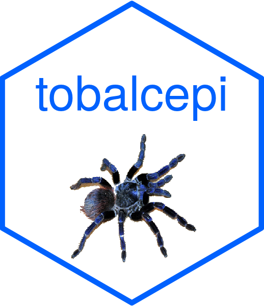

<!-- README.md is generated from README.Rmd. Please edit that file -->

```{r, include = FALSE}
knitr::opts_chunk$set(
  collapse = TRUE,
  comment = "#>",
  fig.path = "man/figures/README-",
  out.width = "100%"
)
```
# Relative Risks and Population Attributable Fractions of Diseases Related to Tobacco and Alcohol 

<!-- badges: start -->

[](https://www.repostatus.org/#active)

[](https://www.tidyverse.org/lifecycle/#stable)

[](https://doi.org/10.17605/OSF.IO/XQ8MV)

<!-- badges: end -->

## The Sheffield Tobacco and Alcohol Policy Modelling Platform
This R package was developed as part of the Sheffield Tobacco and Alcohol Policy Modelling https://stapm.gitlab.io/ by the [School of Health and Related Research at the University of Sheffield](https://www.sheffield.ac.uk/scharr).    

The aim of the research programme is to identify and evaluate approaches to reducing the harm from tobacco and alcohol, with the aim of improving commissioning in a public health policy context, i.e. providing knowledge to support benefits achieved by policymakers.  

The two objectives of the research programme are:

- To evaluate the health and economic effects of past trends, policy changes or interventions that have affected alcohol consumption and/or tobacco smoking
- To appraise the health and economic outcomes of potential future trends, changes to alcohol and/or tobacco policy or new interventions

The STAPM modelling is not linked to the tobacco or alcohol industry and is conducted without industry funding or influence.  

## Purpose of making the code open source
The code has been made open source for the following two reasons:  

- Transparency. Open science, allowing review and feedback to the project team on the code and methods used.
- Methodology sharing. For people to understand the code and methods used so they might use aspects of it in their own work, e.g., because they are doing something partially related that isn't exactly the same job and might like to 'dip into' elements of this code for inspiration.

## Stage of testing and development
The code is actively being used in project work. It is being reviewed and developed all the time; more tests and checks are being added.  

The repository is not intended to be maintained by an open source community wider than the development team.   

## Disease lists

The list of diseases considered in the modelling is available here https://osf.io/v945r

## Code repositories
The code on Github (https://github.com/STAPM/tobalcepi) is a mirror of the code in a private Gitlab repository where the actual development takes place (https://gitlab.com/stapm/r-packages/tobalcepi). The code in the Github repository is linked to a repository on the Open Science Framework, which provides the doi for the package citation (https://osf.io/xq8mv/).    


## Citation

Gillespie D, Webster L, Henney M, Brennan A, Angus C ([YEAR]). tobalcepi: An R Package for Computing the Relative Risks and Population Attributable Fractions of Diseases Related to Tobacco and Alcohol. R package version [x.x.x]. University of Sheffield. https://stapm.github.io/tobalcepi/. doi: https://doi.org/10.17605/OSF.IO/XQ8MV


## Motivation for developing the R package

The motivation for `tobalcepi` was to organise how we store, process and use the information on the risks of disease that stem from tobacco and/or alcohol consumption, including to provide functions to easily use these risk estimates in modelling.     

`tobalcepi` was created as part of a programme of work on the health economics of tobacco and alcohol at the School of Health and Related Research (ScHARR), The University of Sheffield. This programme is based around the development of the Sheffield Tobacco and Alcohol Policy Modelling (STAPM), which aims to use comparable methodologies to evaluate the impacts of tobacco and alcohol policies, and investigate the consequences of clustering and interactions between tobacco and alcohol consumption behaviours.    

## Relative risk data
The disease lists and risk functions in this package all have published sources, which we have referenced [@Angus2018;@webster2018risk]. We have written some working [technical descriptions](https://stapm.gitlab.io/r-packages/tobalcepi/articles/index.html) to explain how these risk functions are implemented in STAPM. In order to obtain mathematical descriptions of the risk functions for use in modelling, we needed to contact some authors to ask for additional information.     

### Alcohol
The high-level function for alcohol is `tobalcepi::RRalc()`, which calculates individual risks of diseases as follows:  

1. **Alcohol - partially-attributable chronic conditions**: dose-response effects of current alcohol consumption on disease risk [@Angus2018] are hard-coded into the function `tobalcepi::RRalc()`. Updates to these risk functions must therefore be made by changing the function code.  
1. **Alcohol - partially-attributable acute conditions**: dose-response effects of single-occasion alcohol consumption are hard coded into the function `tobalcepi::PArisk()`, which is called by `tobalcepi::RRalc()`.     
1. **Alcohol - wholly-attributable acute conditions**: these are not based on published risk functions but are based on thresholds, in UK standard units of alcohol drunk on a single occasion, over which individuals begin to experience an elevated risk for acute diseases that are wholly attributable to alcohol. This is applied by the function `tobalcepi::WArisk_acute()`, which is called by `tobalcepi::RRalc()`.    
1. **Alcohol - wholly-attributable chronic conditions**: these are also based on thresholds in UK standard units of alcohol drunk on average in a week, over which individuals begin to experience an elevated risk for chronic diseases that are wholly attributable to alcohol. This is applied by code within the function `tobalcepi::RRalc()`.    

### Tobacco
1. `tobalcepi::RRtob()` takes a lookup table of the risks associated with current vs. never smoking and assigns these to individuals based on their smoking state, age and sex [@webster2018risk].   
1. We are in the process of developing the function `tobalcepi::RRTobDR()` to stratify the risks of some cancers according to the amount smoked per day by current smokers. There is limited info on these dose-response effects, so we are gradually building up the epidemiological detail in this area as we review, critically appraise and integrate new risk data into our modelling.  

### Lag times
Lag times are the information on the delay between a change to tobacco or alcohol consumption and the decline in the risk of disease associated with that consumption. The relevant functions are `tobalcepi::TobLags()` (which uses lags stored in `tobalcepi::tobacco_lag_times`) and `tobalcepi::AlcLags()` (which contains lags hard-coded into the function). 

### Tobacco - Alcohol risk interactions
We use estimates of potential tobacco - alcohol risk interactions for:  

- Oral cavity cancer  
- Pharyngeal cancer    
- Laryngeal cancer    
- Oesophageal SCC cancer  

These estimates are stored in `tobalcepi::tob_alc_risk_int`.  

## Package data
Some useful, not risk-bearing, data is stored within the package and is installed onto your computer when you download and load the package. We use package data for data that is likely to be used across several projects, that it is important to keep standardised across projects, and is only likely to need updating after a long interval e.g. at least annually.   

The types of data included in tobalcepi are:  

- Lists of the names of the diseases that are related to tobacco and/or alcohol.   
- Parameters used in the modelling of single occasion drinking.  
- Tobacco relative risks of current vs. never smokers.
- Tobacco lag times.  
- Tobacco - alcohol risk interactions.  

When these data need to be updated, the inputs and code in the package folder `data-raw` will need to be changed, and the package rebuild with a new version.  

## Usage
`tobalcepi` is a package for predicting individual risk of disease due to tobacco and alcohol consumption based on published sources, and summarising that risk. The suite of functions within `tobalcepi` processes the published data on the relative risks of disease that stem from chronic and acute alcohol consumption, from smoking, and on the decline in risk after ceasing or reducing consumption. The package also includes functions to estimate population attributable fractions, and to explore the interaction between the disease risks that stem from tobacco and alcohol consumption.         

The **inputs** are the published estimates of relative risk for each disease (sometimes stratified by population subgroup).   

The **processes** applied by the functions in `tobalcepi` give options to estimate:

1. The risk of injury or disease from acute alcohol consumption.  
1. The risk of chronic disease based on the current amount of alcohol consumed.   
1. The risk of chronic disease based on whether someone currently smokes, and how much they currently smoke.   
1. The combined risk of disease in someone who smokes and drinks.  
1. The change in risk of disease after someone ceases or reduces their consumption.  
1. The population attributable fractions of disease to tobacco and/or alcohol (given suitable data on tobacco and alcohol consumption).   

The **outputs** of these processes are datasets in which an individual's tobacco and/or alcohol consumption has been matched to their relative risks of certain diseases, and aggregated datasets that summarise the risks of disease within certain population subgroups.      

## Installation
`tobalcepi` is publicly available via Github.     

By default the user should install the latest tagged version of the package. Otherwise, if you want to reproduce project work and know the version of the package used, install that version.  

If on a University of Sheffield managed computer, install the R, RStudio and Rtools bundle from the Software Centre. Install Rtools - using the [installr](https://cran.r-project.org/web/packages/installr/index.html) package can make this easier. Then install the latest or a specified version of `tobalcepi` from Github with:     

```{r gh_installation, message=FALSE, eval = FALSE}
#install.packages("devtools")

devtools::install_git(
  "https://github.com/stapm/tobalcepi.git", 
  ref = "x.x.x",
  build_vignettes = FALSE)

# ref = "x.x.x" is the version to install - change to the version you want e.g. "1.2.3"
```

Or clone the package repo locally and use the 'install and restart' button in the Build tab of RStudio. This option is more convenient when testing development versions.   

Then load the package, and some other packages that are useful. Note that the code within `tobalcepi` uses the `data.table::data.table()` syntax.  

```{r pkgs, eval = F}
# Load the package
library(tobalcepi)

# Other useful packages
library(dplyr) # for data manipulation and summary
library(magrittr) # for pipes
library(ggplot2) # for plotting
```

## References


